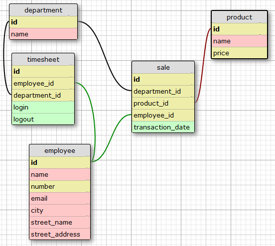

# SQL Basics: Simple FULL TEXT SEARCH

For this challenge you need to create a simple SELECT statement. Your task is to create a query and do a FULL TEXT SEARCH. You must search the product table on the field name for the word Awesome and return each row with the given word. Your query MUST contain to_tsvector and to_tsquery PostgreSQL functions.

Tables and relationship below:

		

```sql
--PostgreSQL 9.6
select id
	,name
	,price
from product
where to_tsvector(name) @@ to_tsquery('awesome')
```
