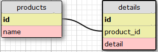

# SQL Basics: Simple PIVOTING data WITHOUT CROSSTAB

This kata is inspired by SQL Basics: Simple PIVOTING data by matt c.

You need to build a pivot table WITHOUT using CROSSTAB function. Having two tables products and details you need to select a pivot table of products with counts of details occurrences (possible details values are ['good', 'ok', 'bad'].
Results should be ordered by product's name.'

Model schema for the kata is:

		

your query should return table with next columns

- name
- good
- ok
- bad

Compare your table to the expected table to view the expected results.

```sql
--PostgreSQL 9.6
select p.name,
	count(case when d.detail = 'good' then d.detail end) as good,
	count(case when d.detail = 'ok' then d.detail end) as ok,
	count(case when d.detail = 'bad' then d.detail end) as bad
from products p
inner join details d on p.id = d.product_id
group by p.name
order by p.name
```
